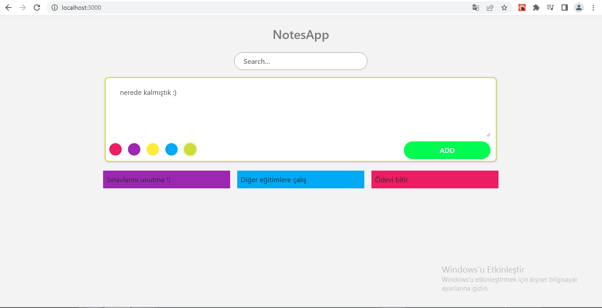
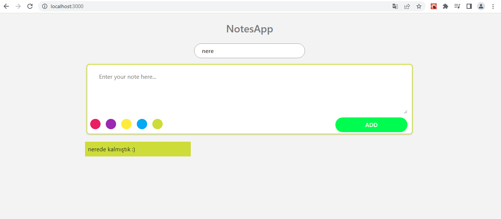

### Notes App With React && Redux

### repoyu klonlayın

```
git clone https://github.com/EmirhanAltuntas/patika-redux-tasks.git
```

### klasör dizinine gidin ve visual studio code ile açın
```
cd task1-notes-app-with-redux
code .
```
### server için 
```
cd api
npm run server
```

### client için 
```
cd client
npm start
```

### eksik paketleri kurun
```
npm install
```




